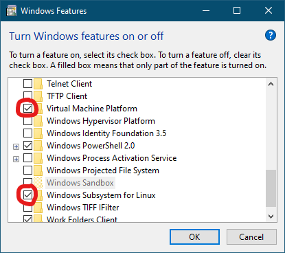

# learning-docker

Опанування базових налаштування та використання Docker, пройшовши курс на https://docs.docker.com/get-started/introduction/get-docker-desktop/

## 1. Системні вимоги (WSL 2 backend)

✅ Windows 10 Education 22H2 (build 19045.5131)  
✅ Увімкнув віртуалізацію в BIOS  
  
✅ Увімкнув необхідні можливості  
  
✅ Встановив WSL  
  
✅ Перезапустив ПК

> [!WARNING]
> Щоб запустити контейнери Windows, потрібна Windows 10 або Windows 11 Professional або Enterprise. Випуски Windows Home або Education дозволяють запускати лише контейнери Linux.

## 2. Інтерактивне встановлення

1. Завантажив інсталятор
   
2. Запустив інсталятор подвійним кліком
   
3. Успішно встановив
   
4. Зареєстрував персональний акаунт
   
5. Пройшов коротке опитування
   

## 3. Перший контейнер

1. Запустив welcome-to-docker за допомогою терміналу
   
2. Перейшов за посиланням http://localhost:8080 у браузері
   

## 4. Управління контейнерами у Docker Desktop

1. У вкладці Containers обрав запущений контейнер
   
2. Перейшов у вкладку Exec та вивів зміст контейнеру на екран за допомогою команди
   
3. Знайшов контейнер для наступної роботи через поле пошуку
   
